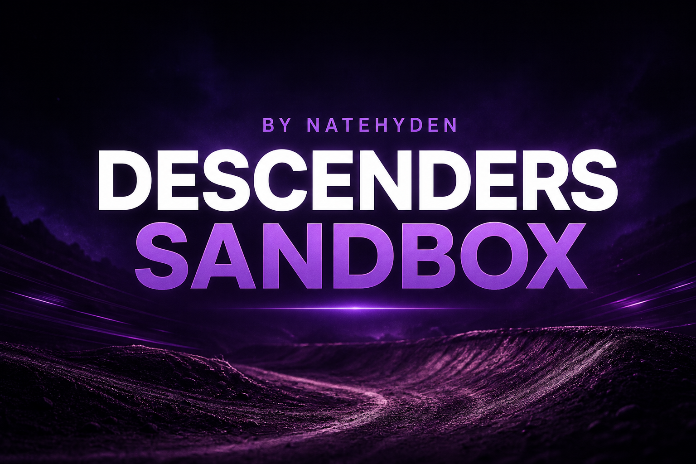
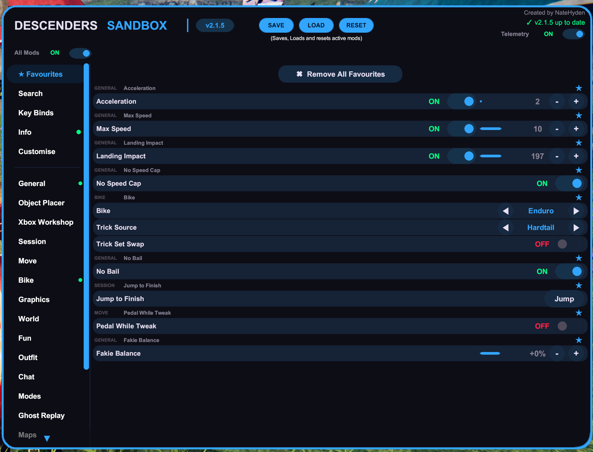
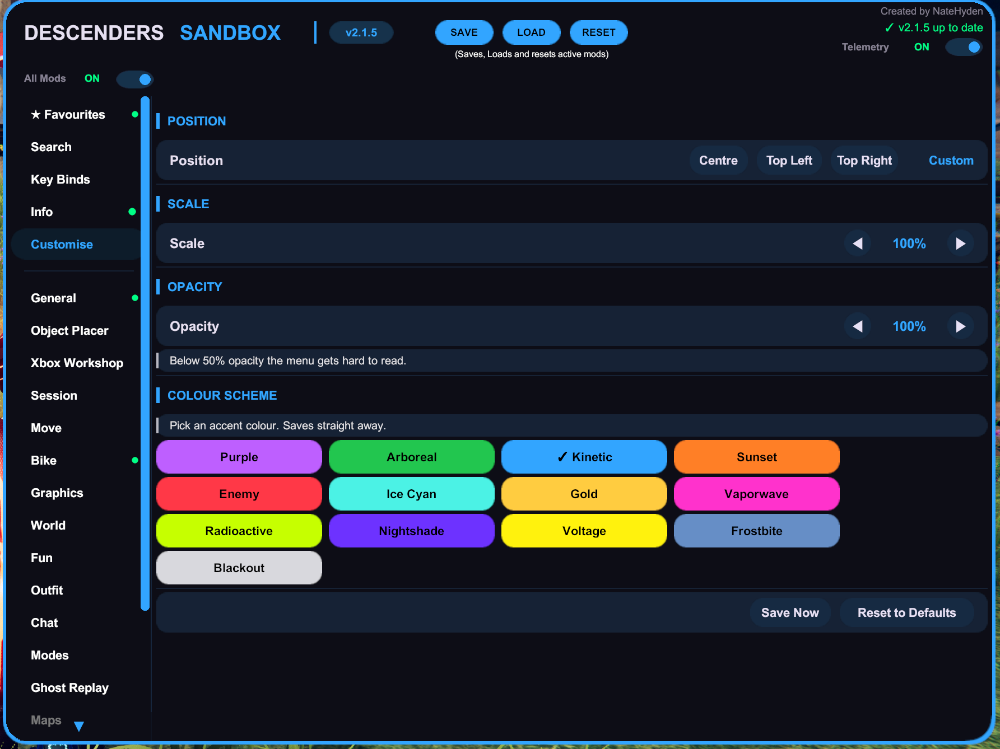

  

# Descenders Sandbox

**Descenders Sandbox** is a free-ride physics sandbox mod menu for **Descenders**, built with MelonLoader. Take control of your ride and the world around you with a huge collection of physics tweaks, custom game modes, map tools, gameplay modifiers, and more — all designed to let you play Descenders your way.

  

> ⚠️ **Free Ride and Bike Park only.** Sandbox features will not work in online race lobbies — this is for messing around solo or with friends offline, not a competitive advantage tool. The one exception is the **Career** tools, which are built specifically for editing career-mode progression and only make sense there.

**Press `F6` or `D-Pad Down`** in-game to open the menu — fully rebindable, see [Key Binds](#key-binds).

---

## Quick Install

**Steam:** Install [MelonLoader](https://github.com/LavaGang/MelonLoader/releases) → Select version **0.5.7** from the drop down menu → drop `DescendersSandbox.dll` from [Releases](https://github.com/NateHyden/DescendersSandboxModKit/releases) into `Descenders/Mods/` → launch. [Full Steam Installation](#installation-steam)

**Xbox / Game Pass:** needs a couple of extra steps — see the full [Xbox install guide](#installation-xbox) below.

---

## Contents

- [Features](#features)
- [Requirements](#requirements)
- [Installation — Steam](#installation-steam)
- [Installation — Xbox PC / Game Pass](#installation-xbox)
- [Privacy, Telemetry & Network Activity](#privacy-telemetry-network)
- [Links](#links)

---

## Features

100+ tools across 25 categories. Jump to what you're after:

[Object Placer](#object-placing) · [Bike Physics](#bike-physics) · [Bike Setup](#bike-setup) · [Movement & Controls](#movement-controls) · [World](#world) · [Map](#map) · [Spot Book](#spot-book) · [Fun](#fun) · [Other](#chaos-extras) · [Outfit](#outfit) · [Chat](#chat) · [Modes](#modes) · [Ghost Replay](#ghost-replay) · [Find](#teleport) · [Screenshot](#screenshot) · [Session](#session) · [Graphics](#graphics) · [Favourites](#favourites) · [Key Binds](#key-binds) · [Customise](#customise) · [Career Progression](#career-progression) · [Info](#system)

### 🗺️ mod.io Custom Maps for Xbox / Game Pass

Download and play mod.io custom maps on Xbox/Game Pass on PC.

### 🏗️ Object Placer

Place down objects in the map, like ramps and walls.

- **Full Control** — Position and rotate objects to any angle
- **Favourites** — Save your placements for easy reuse on any map
- **Scan Map** — Pull placeable meshes from the current map into your library
- **Quick Exit** — Esc/B auto-closes the menu and returns you to your bike

### ⏻ Mods Master Switch

Does what it says on the tin — instantly pause every active mod, flip back to restore your set.

### 🚲 Bike Physics

Tune every aspect of how your bike handles.

- **Acceleration** — Boost your pedal power
- **Max Speed** — Set a custom top speed
- **No Speed Cap** — Remove the game's top speed limit entirely
- **Speed Limiter** — Cap your speed to a value you type in (same units as the speedo)
- **No Bail** — Makes it harder to fall off
- **Auto Balance** — Helps keep you upright
- **Landing Impact** — Adjust how forgiving bail detection is on landings
- **Tyre Pressure** — Change grip and handling feel
- **Brake Fade** — Simulate brake fade over time
- **Brake Balance** — Shift braking bias front or rear
- **Quick Brake** — Snappier braking power and shorter stopping distance, adjustable level
- **Instant Respawn** — Skip the bail animation and get back riding immediately
- **Sticky Tyres** — Extra grip on all surfaces
- **Cut Brakes** — Disable braking entirely
- **No Speed Wobbles** — Stop the high-speed wobble
- **Slow Motion** — Slow the whole game down, adjustable strength
- **Slow Mo on Bail** — Drop into slow-mo when you bail
- **Launch** — Fire yourself forward for testing lines

### 🛠️ Bike Setup

- **Bike Switcher** — Change your bike type on the fly
- **Trick Set Swap** — Borrow another bike's trick set
- **Bike Size** — Scale the bike up or down
- **Wheel Size** — Adjust front and rear wheel size independently
- **Wide Tyres** — Inflate the tyre width
- **Invisible Bike** — Hide the bike mesh
- **Bike Damage** — Visual damage tinting on bail
- **Bike Torch** — Toggle the headlight
- **Disco Torch** — Cycle the headlight through neon colours
- **Trick Speed** — Adjust how fast trick animations play out
- **Suspension HUD** — On-screen readout of live suspension compression
- **Bouncy Bike** — Bounce off impacts instead of stopping, adjustable bounciness
- **Spider Bike** — Stick to any surface, walls and ceilings included

### 🎮 Movement & Controls

- **Rotation Speed** — Amplify bar spins
- **Hop Force** — Adjust bunny hop height
- **Wheelie Force** — Make wheelies easier or harder
- **Wheelie Balance** — Adjust how easy it is to hold a wheelie steady
- **Wheelie Angle Limit** — Cap or expand how far back you can lean
- **Wheelie HUD** — On-screen angle readout while wheeling
- **Lean Strength** — Adjust mid-air lean sensitivity
- **Air Control / Air Correction** — Fine tune how much you can steer in the air
- **Fakie Balance** — Easier balance while riding backwards
- **Pump Strength** — Adjust how effective pumping through terrain is
- **Tweak Speed** — Adjust how quickly bike tweaks/adjustments respond
- **Pedal While Tweak** — Keep pedalling while a tweak animation plays instead of freezing your input
- **Pedal While Reverse** — Pedal to accelerate even while moving backwards
- **Reverse Steering** — Flip your handlebar input
- **Rubber Band Steering** — Delays your steering and lean input for a loose, floaty feel — like riding on a rubber band
- **Near Miss Sensitivity** — Change how close is "close enough" for near miss scoring
- **Center of Mass** — Shift weight distribution on the bike
- **Suspension** — Tune stiffness, damping, and travel

### 🌍 World

- **Gravity** — Crank it up for moon physics or down for heavy riding
- **Time of Day** — Scrub through the day/night cycle
- **Sky Colours** — Tint the sky and lighting with several presets
- **Blizzard Dial** — Dial in snow accumulation and pick a season (Spring/Summer/Autumn/Winter)
- **Fog** — Add atmospheric fog
- **Trees & Foliage** — Toggle environmental props
- **Turbo Wind** — Crank up wind intensity
- **Exploding Props** — Props launch on impact
- **Storm** — Toggle storm weather
- **Ice Grip** — Minimal grip for a slidey, chaotic ride
- **Disco Mode** — Cycle your rider and bike through a neon colour palette, adjustable speed
- **Music Toggle** — Turn the in-game soundtrack on or off
- **Headlights Only** — Kill all ambient/directional lighting so only your headlight illuminates the world
- **Compass Always On** — Keep the finish-line direction indicator visible at all times

### 🗺️ Map

- **Map Changer** — Load any base game map or bike park instantly
- **Load from Seed** — Enter a seed number to load a specific procedural map

### 📍 Spot Book

Save the places you like and jump straight back to them.

- **Save spots** — Drop a named pin on the map you're on, rename it, jump back with GO, or delete it
- **All Spots** — Browse every spot you've saved across all maps, with search when the list gets long
- Works on normal maps, freeride, and workshop / mod.io maps — loads the map for you if needed
- **Crew Perks** — Tick the perks you want, then hit **GO+** to load in with them on
- Pin Spot Book to Favourites for quick access mid-session

### 🎭 Fun

- **Player Size** — Scale your rider up or down
- **Invisible Player** — Hide the rider mesh
- **Moon Mode** — Low gravity preset
- **Mirror Mode** — Flip the world horizontally
- **Fly Mode** — Detach from the ground and fly freely, with separate side-to-side and up/down speed
- **Hover Mode** — Float your bike at an adjustable height above the terrain
- **Drunk Mode** — Wobbly, disorienting controls
- **Camera Shake** — Add intensity to the camera
- **FOV** — Adjust field of view
- **Cartoon Squash** — Bounce or squash-and-stretch on landings, adjustable speed/amount, with a separate soft-body Jelly Mode
- **Ride On Water** — Stops water (and other kill volumes) from auto-bailing you, and makes them solid so you can ride on them

### 🎪 Other

- **Trail Painter** — Leaves a coloured trail behind your bike, cycle through colours
- **Confetti on Trick Landing** — Confetti burst every time you stick a trick
- **Airhorn** — Just what it sounds like
- **Big Head Mode** — Adjustable head size
- **Chaos Mode** — Randomly flips Ice/Mirror/Drunk/Reverse Steering every few seconds — everything reverts cleanly when turned off
- **Random Bike Switch** — Automatically swaps your bike every few seconds
- **Random Mutator on Checkpoint** — Rolls a random modifier each time you hit a checkpoint
- **Random Weather Roulette** — Cycles between Storm, Fog, Moon Mode, and Normal every 12–25 seconds instead of one fixed pick

### 👗 Outfit

- **Outfit Presets** — Save and load full rider outfit combinations, sets your preferred bike and keeps it across maps
- **Rider Customiser** — Live-edit skin, hair, beard, and body type
- **Go To Shed / Leave Shed** — Jump straight into the outfit shed to preview gear, then return to exactly where you were

**Lux Custom Colour** — full outfit tinting, independent of the game's own Lux system:

- Per-slot tint: Bike, Helmet, Goggles, Jersey, Pants — hue, brightness, and a colour wheel
- **Everything Rainbow** — all slots cycle together like the stock rainbow Lux, with shared brightness and speed
- Brightness and speed adjustable in 10% steps (10%–400%)
- 3 preset slots to save and recall full glow setups
- Off / All Vanilla restores your pre-Lux outfit; colours and brightness persist across map changes
- Outfit **SAVE** is blocked while Lux is active, to avoid saving a glow state into a normal preset

### 💬 Chat

- In-menu chat system for communicating with other Descenders Sandbox users nearby
- **On-Screen Chat Popup** — Show incoming messages as a HUD popup while you ride

### 🎮 Modes

Custom game modes you can run in free ride:

- **Earthquake Mode** — Ground shakes at set intervals with adjustable intensity and frequency
- **Police Chase Mode** — Hazards hunt you down with difficulty scaling
- **Trick Attack Mode** — Race to hit a score target before time runs out
- **Boulder Dodge Mode** — Boulders rain down — dodge them for as long as you can
- **Survival Mode** — Stay on your bike and don't bail
- **Avalanche Mode** — Outrun a rolling hazard chasing you down the mountain
- **Lava Rising** — The floor is lava: climb before it catches you, with adjustable climb time and a per-map height record

### 👻 Ghost Replay

Record a run and replay your ghost alongside you for self-competition.

### 🎯 Find

- **Visual Player Finder** — Spot nearby players with tracers and distance display
- **World Object Finder** — Highlights collectibles, shortcuts, boost pads, hazards, and checkpoints
- **Teleport to Player** — Jump to another player's position
- **Teleport to Checkpoint** — Jump to any checkpoint in the map
- **Detect Sandbox Users** — Scan the lobby for other Descenders Sandbox users
- **Sandbox Users HUD** — Top-right counter of Sandbox users in the lobby, updates automatically

### 📸 Screenshot

- **Screenshot Mode** — Hide the HUD and UI for clean captures, triggered via D-Pad Up on controller or F11 on keyboard

### 🖥️ Session

- **Session HUD** — On-screen tracker showing current run stats, top speed, longest airtime, peak G-force, bails, checkpoints, and session timer — each tracker can be toggled on or off
- **Speedrun Timer** — A clean on-screen timer for self-timed runs
- **Spectate Mode** — Watch another connected player instead of riding yourself. Cycle between players, adjust the camera distance, turn on anytime while playing with others
- **Trick Multiplier** — Set your trick score multiplier directly instead of building it through combos
- **Black Death** — Temporary full-screen blackout hazard
- **Jump to Finish** — Instantly warp to the map's finish line
- **Respawn at Start** — Instantly reset back to the start of the run
- **Skip Song** — Skip to the next track in the in-game soundtrack

### 🎨 Graphics

- **Presets** — Max Detail, Ultra, or Default in one click
- **Bloom, Ambient Occlusion, Depth of Field, Vignette, Chromatic Aberration, Eye Adaptation, Color Grading, Motion Blur, SSR, PP Fog, Grain** — Toggle post processing effects individually
- **Shadows, Soft Particles, Anti-Aliasing** — Extra render toggles
- **Shadow Distance / Resolution / Cascades**, **Textures**, **Anisotropic**, **LOD Bias**, **Pixel Lights** — Dial in detail
- **VSync** and **FPS Cap**
- **Quality** — Switch render quality preset
- **Hide Game HUD** — Remove the in-game interface

### ⭐ Favourites

Pin any setting to your Favourites tab for quick access without digging through menus. A dedicated Search tab lets you find any setting by name.

### ⌨️ Key Binds

Bind any key on your keyboard to toggle mods or trigger actions without opening the menu.

- 110 bindable actions covering every toggle, mode, and one-shot action in the mod
- Default bindings: **F2** = Slow Motion, **F3** = Ghost Replay Toggle, **F4** = Ghost Replay Save
- The menu-open button itself is also bindable — to any keyboard key **or** controller button (default D-Pad Down)
- Bindings are saved automatically and loaded on every launch
- Conflict detection — if a key is already in use, you'll be prompted to steal it or cancel
- Bindings work whenever the menu is closed and no text field is focused

### 🎛️ Customise

- **Position** — Centre, Top Left, or Top Right presets
- **Drag to move** — Grab the top bar of the menu and place it anywhere on screen
- **Scale** — Resize the whole menu
- **Opacity** — Adjust menu transparency
- **Colour Scheme** — Pick from a set of accent-colour presets, applies instantly and saves automatically

  

### 🏆 Career Progression

Separate from the free-ride sandbox tools above — these are save-editing tools for your own single-player career save.

- **Complete All Missions** — Instantly complete every mission
- **Complete Grand Tour** — Instantly complete every Grand Tour challenge (Developer Tour, Encore Tour, and any others)
- **Level Reset** — Wipe level progress
- **Sponsor Reset / Switch Sponsor / Max Sponsor Level** — Reset, change, or max out your sponsor progression
- **Unlock All (Bikes + Gear)** — Unlock or lock every bike and gear item instantly
- **Adjust Total Rep / In-Game Rep** — Manually add or subtract rep, with an adjustable step multiplier, or type an exact value

### ℹ️ Info

- **Engine & mod info** — Unity version, MelonLoader version, mod version, at a glance
- **Steam player count** — See how many Steam players are playing Descenders right now
- **Update Checker** — Automatically checks GitHub for new Sandbox releases on launch
- **Telemetry (opt-in)** — Disabled by default; see [Privacy, Telemetry & Network Activity](#privacy-telemetry-network)
- **Feedback** — Send a bug report, feature request, or general feedback straight from the menu to Discord

---

## Requirements

- **Descenders** (Steam or Xbox PC / Game Pass)
- **MelonLoader 0.5.7** — [github.com/LavaGang/MelonLoader/releases](https://github.com/LavaGang/MelonLoader/releases) — pick **0.5.7** from the installer dropdown (not the newest build)

---

## Installation — Steam

1. Run the MelonLoader installer — it will auto-detect your Descenders installation. Select version **0.5.7** from the dropdown and hit installl

  

2. Launch the game once to let MelonLoader set up its folders, then close it
3. Download `DescendersSandbox.dll` from the [Releases page](https://github.com/NateHyden/DescendersSandboxModKit/releases)
4. Drop it into your `Descenders/Mods/` folder
5. Launch the game and press **F6** to open the menu

If updating from an older version, delete any previous `DescendersModMenu.dll`, `DescendersToolKit.dll`, or `DescendersSandbox.dll` from your Mods folder first.

---

## Installation — Xbox PC / Game Pass

MelonLoader works on the Xbox PC (Game Pass) version but needs a couple of extra steps due to Windows App Store permissions.

> ⚠️ The Xbox / Game Pass version is largely untested. Most features work but some behaviour may differ from the Steam version.

<strong>Step-by-step Xbox install</strong>

**Recommended: Move the game out of WindowsApps first**

The default install location (`C:\Program Files\WindowsApps`) is heavily permission-locked. It's much easier to move the game first:

1. Open the Xbox app → right-click Descenders → **Manage → Files → Change drive**
2. Select a drive you own (e.g. `D:\`) and confirm
3. If in doubt, uninstall and reinstall to your chosen drive — your saved data will not be lost

**Finding your game files (if already installed)**

Same process as above — right-click Descenders → **Manage → Files**, but click **Browse** instead of Change drive. This opens the install folder directly in Explorer.

If you're stuck in the default WindowsApps location, right-click the folder → Properties → Security → Edit → add your user account and grant Full Control.

**Installing MelonLoader**

1. Run the [MelonLoader](https://github.com/LavaGang/MelonLoader/releases) installer
2. MelonLoader won't auto-detect the Xbox version — click **Add Game** and navigate to your xbox install location for `Descenders.exe` manually
3. Make sure version **0.5.7** is selected from the drop down menu, then install *(same installer screen as pictured in the [Steam instructions](#installation-steam) above)*
4. Launch the game once to populate MelonLoader's folders, then close it
5. Download `DescendersSandbox.dll` from the [Releases page](https://github.com/NateHyden/DescendersSandboxModKit/releases) and drop it into the `Mods` folder
6. Launch the game and press **F6**

---

## Privacy, Telemetry & Network Activity

Descenders Sandbox can make network requests for the following purposes:

| Purpose | Service | Opt-in? |
|---|---|---|
| Check for mod updates | GitHub | Always on, read-only, never auto-installs |
| Current Descenders player count | Steam Web API | Always on |
| Error/warning diagnostics + manual feedback | Discord (private channel) | **Telemetry: opt-in.** Feedback: only when you submit it |
| Mod Chat & other multiplayer features | Photon / Descenders networking | Always on when using those features |
| Custom map browsing (Xbox/Game Pass) | mod.io | Only when using the Workshop tab |

**No passwords, authentication tokens, browser data, or personal files are collected, ever.**

<strong>Telemetry details</strong>

Telemetry is disabled by default and can be enabled in the Sandbox settings. When enabled, diagnostic information — Sandbox version, platform, loaded mods, your Descenders/Photon player name, and relevant error or warning details — may be sent to a private Discord channel to help diagnose and fix bugs. It's only sent when an error or warning actually occurs, unless you explicitly submit feedback.

**You're in control:** leave telemetry off and nothing is sent. Update checking, Steam player count, Mod Chat, and mod.io maps all work independently of telemetry and can't be disabled the same way, since they're core to the features themselves.

If you hit a bug and want to help fix it: enable telemetry → reproduce the issue → turn telemetry back off when you're done. That's it.

<strong>Why does the mod use PowerShell?</strong>

The Xbox/Game Pass version of Descenders restricts the HTTP APIs normally available to mods. To keep the Steam and Xbox/Game Pass versions on the same codebase, the mod uses PowerShell for two things: checking GitHub for available Sandbox updates, and retrieving the current Descenders player count from Steam. The mod never automatically updates itself, and the GitHub check only looks for available releases — it doesn't silently download, install, or execute anything.

I make this mod for the Descenders community, and it will always be free.

---

## Links

- **VirusTotal:** [scan results](https://www.virustotal.com/gui/file/bc042a743b16c5c41094557b675d6be80814ceffae4ea2cc80c64151a5b50069/detection)
- **Discord:** [discord.gg/rHvCrBdqaR](https://discord.gg/rHvCrBdqaR)
- **Nexus Mods:** [nexusmods.com/descenders/mods/8](https://www.nexusmods.com/descenders/mods/8)
